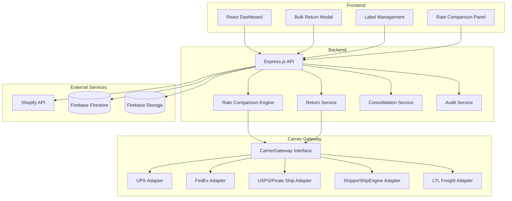
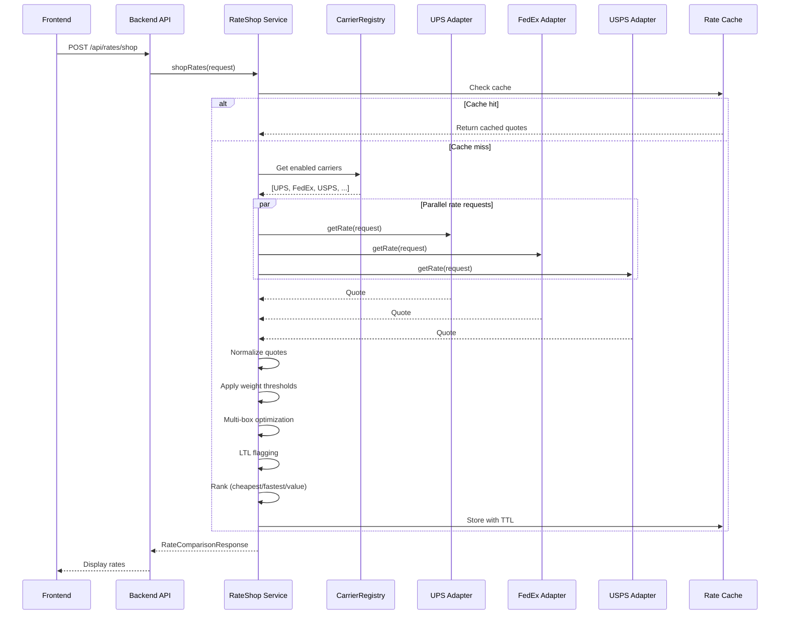
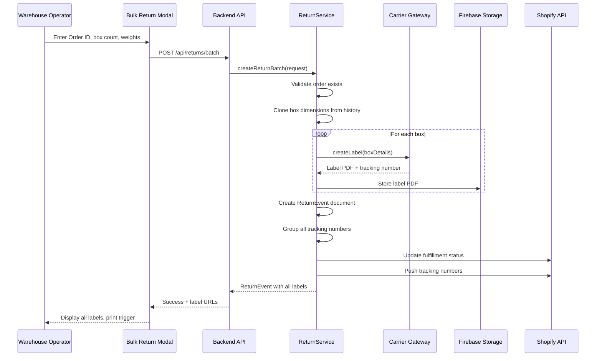
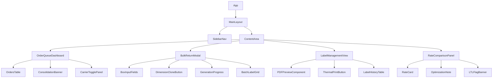

# American Tile Depot - Custom Shipping Platform Architecture

## System Overview



## Project Structure

```
shipsmart/
├── packages/
│   ├── backend/                    # Node.js + Express API
│   │   ├── src/
│   │   │   ├── config/             # Environment & Firebase config
│   │   │   ├── controllers/        # Request handlers
│   │   │   ├── services/           # Business logic
│   │   │   │   ├── carriers/       # Carrier gateway adapters
│   │   │   │   ├── rate-shop.ts    # Rate comparison engine
│   │   │   │   ├── returns.ts      # Multi-box return logic
│   │   │   │   ├── consolidation.ts # Order consolidation
│   │   │   │   ├── audit.ts        # Audit trail logging
│   │   │   │   └── shopify.ts      # Shopify sync service
│   │   │   ├── models/             # TypeScript interfaces
│   │   │   ├── routes/             # API route definitions
│   │   │   ├── middleware/         # Auth, validation, error handling
│   │   │   ├── utils/              # Dimensional weight, zone calc
│   │   │   └── index.ts            # Express app entry point
│   │   ├── package.json
│   │   └── tsconfig.json
│   │
│   ├── frontend/                   # React + Vite
│   │   ├── src/
│   │   │   ├── components/         # Reusable UI components
│   │   │   │   ├── dashboard/      # Order queue dashboard
│   │   │   │   ├── returns/        # Bulk return modal
│   │   │   │   ├── labels/         # Label management views
│   │   │   │   ├── rates/          # Rate comparison panel
│   │   │   │   └── consolidation/  # Consolidation alerts
│   │   │   ├── hooks/              # Custom React hooks
│   │   │   ├── services/           # API client wrappers
│   │   │   ├── stores/             # State management (Zustand)
│   │   │   ├── types/              # Shared TypeScript types
│   │   │   ├── utils/              # Formatting, validation
│   │   │   └── App.tsx
│   │   ├── package.json
│   │   └── tsconfig.json
│   │
│   └── shared/                     # Shared types & utilities
│       ├── src/
│       │   ├── schemas.ts          # Firestore schema definitions
│       │   ├── carriers.ts         # Carrier constants & config
│       │   └── validation.ts       # Shared validation rules
│       ├── package.json
│       └── tsconfig.json
│
├── plans/                          # Architecture & planning docs
├── package.json                    # Root workspace config
└── turbo.json                      # Turborepo config (optional)
```

---

## Phase 1: Project Setup & Foundation

### Monorepo Structure
- Use npm workspaces or pnpm for package management
- Shared types package for TypeScript interfaces used by both frontend and backend
- Turborepo for build orchestration (optional, adds caching)

### Backend Setup
- Express.js with TypeScript
- Firebase Admin SDK for Firestore and Storage
- dotenv for environment configuration
- winston for structured logging
- express-validator for request validation
- cors, helmet for security

### Frontend Setup
- React 18+ with Vite
- TypeScript strict mode
- Zustand for state management (lightweight, no boilerplate)
- React Query for server state and caching
- Tailwind CSS for styling (warehouse-optimized, high density)
- Radix UI for accessible primitives
- React Table for data grids

---

## Phase 2: Data Schema Design

### Firestore Collections

#### orders
```typescript
interface Order {
  id: string;                    // Shopify order ID
  shopifyOrderId: string;        // Original Shopify order ID
  customerName: string;
  customerEmail: string;
  shippingAddress: Address;
  lineItems: LineItem[];
  totalWeight: number;           // Total weight in lbs
  boxCount: number;              // Number of boxes in original shipment
  status: 'pending' | 'shipped' | 'returned' | 'consolidated';
  createdAt: Timestamp;
  updatedAt: Timestamp;
  syncedAt: Timestamp;           // Last Shopify sync timestamp
}
```

#### shipments
```typescript
interface Shipment {
  id: string;                    // Auto-generated
  orderId: string;               // Reference to orders collection
  type: 'outbound' | 'return';
  carrier: CarrierId;
  serviceLevel: string;          // e.g., 'GROUND', '2DAY', 'PRIORITY'
  trackingNumbers: string[];     // Multiple for multi-box
  labels: LabelRef[];            // References to Firebase Storage
  fromAddress: Address;
  toAddress: Address;
  boxes: BoxDetail[];
  totalCost: number;
  currency: string;
  status: 'created' | 'label_generated' | 'in_transit' | 'delivered';
  createdAt: Timestamp;
  shippedAt: Timestamp | null;
  deliveredAt: Timestamp | null;
  shopifySynced: boolean;
  shopifySyncedAt: Timestamp | null;
}
```

#### returnEvents
```typescript
interface ReturnEvent {
  id: string;
  originalOrderId: string;       // Reference to original order
  originalShipmentId: string;    // Reference to original shipment
  returnShipmentId: string;      // Reference to return shipment
  boxCount: number;
  boxes: ReturnBoxDetail[];
  carrier: CarrierId;
  totalCost: number;
  trackingNumbers: string[];
  labels: LabelRef[];
  status: 'pending' | 'labels_generated' | 'in_transit' | 'received';
  createdAt: Timestamp;
  receivedAt: Timestamp | null;
  notes: string;
}
```

#### rateQuotes
```typescript
interface RateQuote {
  id: string;
  shipmentContext: ShipmentContext;  // Weight, dimensions, destination
  quotes: CarrierQuote[];
  selectedCarrier: CarrierId | null;
  selectedQuoteIndex: number | null;
  costDelta: number;             // Delta vs cheapest option
  createdAt: Timestamp;
  sessionId: string;             // Group quotes from same rate shop session
}

interface CarrierQuote {
  carrier: CarrierId;
  serviceLevel: string;
  rate: number;
  currency: string;
  estimatedDays: number;
  dimensionalWeight: number;
  billableWeight: number;
  zone: number | null;
  isCheapest: boolean;
  isFastest: boolean;
  isBestValue: boolean;
  requiresLTL: boolean;
}
```

#### carrierConfigs
```typescript
interface CarrierConfig {
  id: CarrierId;                 // 'ups', 'fedex', 'usps', 'shippo', 'ltl'
  enabled: boolean;
  name: string;
  priority: number;              // Order in rate comparison display
  weightLimit: number;           // Max weight in lbs
  lastRateFetch: Timestamp | null;
  errorCount: number;
}
```

#### auditLogs
```typescript
interface AuditLog {
  id: string;
  action: 'rate_shop' | 'label_generated' | 'return_created' | 'consolidation' | 'tracking_synced';
  userId: string;                // Firebase auth UID
  shipmentId: string | null;
  returnEventId: string | null;
  details: Record<string, unknown>;
  timestamp: Timestamp;
}
```

### Firestore Security Rules
```javascript
rules_version = '2';
service cloud.firestore {
  match /databases/{database}/documents {
    // Only authenticated users can access
    match /{document=**} {
      allow read, write: if request.auth != null;
    }
    
    // Orders: read-only for most users, write for admins
    match /orders/{orderId} {
      allow read: if request.auth != null;
      allow write: if request.auth.token.admin == true;
    }
    
    // Shipments: full access for authenticated users
    match /shipments/{shipmentId} {
      allow read, write: if request.auth != null;
    }
    
    // Rate quotes: append-only
    match /rateQuotes/{quoteId} {
      allow read: if request.auth != null;
      allow create: if request.auth != null;
      allow update, delete: if false;  // Immutable audit trail
    }
    
    // Audit logs: append-only
    match /auditLogs/{logId} {
      allow read: if request.auth != null;
      allow create: if request.auth != null;
      allow update, delete: if false;  // Immutable audit trail
    }
  }
}
```

---

## Phase 3: Carrier Gateway Abstraction Layer

### CarrierGateway Interface

```typescript
interface CarrierGateway {
  /**
   * Unique identifier for this carrier
   */
  readonly id: CarrierId;
  
  /**
   * Human-readable carrier name
   */
  readonly name: string;
  
  /**
   * Get rate quote for a shipment
   */
  getRate(request: RateRequest): Promise<CarrierQuote>;
  
  /**
   * Generate shipping label
   */
  createLabel(request: LabelRequest): Promise<LabelResponse>;
  
  /**
   * Void/cancel a label
   */
  voidLabel(trackingNumber: string): Promise<void>;
  
  /**
   * Get tracking status
   */
  trackPackage(trackingNumber: string): Promise<TrackingStatus>;
  
  /**
   * Check if carrier can handle this shipment
   */
  canHandle(request: RateRequest): boolean;
  
  /**
   * Calculate dimensional weight for this carrier
   */
  calcDimensionalWeight(length: number, width: number, height: number): number;
}
```

### Rate Request/Response Types

```typescript
interface RateRequest {
  fromAddress: Address;
  toAddress: Address;
  packages: PackageDetail[];
  shipDate: Date;
  serviceLevels?: string[];      // Optional filter
}

interface PackageDetail {
  weight: number;                // Actual weight in lbs
  length: number;                // Inches
  width: number;                 // Inches
  height: number;                // Inches
  declaredValue: number;         // USD
}

interface CarrierQuote {
  carrier: CarrierId;
  serviceLevel: string;
  rate: number;
  currency: string;
  estimatedDays: number;
  dimensionalWeight: number;
  billableWeight: number;
  zone: number | null;
  requiresLTL: boolean;
  metadata: Record<string, unknown>;
}
```

### Dimensional Weight by Carrier

| Carrier | Divisor |
|---------|---------|
| UPS | 139 |
| FedEx | 139 |
| USPS | 166 (Priority), 194 (Retail) |
| LTL | Varies by class |

### Carrier-Specific Weight Limits

| Carrier | Max Weight per Package | Max Length + Girth |
|---------|----------------------|-------------------|
| UPS | 70 lbs (standard), 150 lbs (freight) | 165 inches |
| FedEx | 150 lbs (standard) | 165 inches |
| USPS | 70 lbs (most services) | 130 inches |
| LTL | 150+ lbs | No limit |

---

## Phase 4: Rate Comparison Engine

### RateShop Service Flow



### Rate Ranking Algorithm

```typescript
interface RateComparisonResponse {
  quotes: CarrierQuote[];
  cheapest: CarrierQuote;
  fastest: CarrierQuote;
  bestValue: CarrierQuote;
  ltlRecommended: boolean;
  multiBoxOptimization: MultiBoxOption[];
  weightThresholdNote: string | null;
}
```

**Best Value Calculation:**
- Score = (normalized_cost * 0.6) + (normalized_speed * 0.4)
- Lower score = better value
- Normalized to 0-1 scale across all quotes

### Multi-Box Optimization Logic

```typescript
// Example: Is one 80lb box cheaper than two 40lb boxes?
function optimizeBoxConfiguration(
  totalWeight: number,
  dimensions: Dimensions,
  carriers: CarrierGateway[]
): MultiBoxOption[] {
  const options: MultiBoxOption[] = [];
  
  // Option 1: Single box
  options.push({
    boxCount: 1,
    boxes: [{ weight: totalWeight, ...dimensions }],
    rates: getRatesForConfiguration(...)
  });
  
  // Option 2: Split at carrier weight limits
  if (totalWeight > 70) {
    const boxCount = Math.ceil(totalWeight / 70);
    const weightPerBox = totalWeight / boxCount;
    options.push({
      boxCount,
      boxes: Array(boxCount).fill({ weight: weightPerBox, ...dimensions }),
      rates: getRatesForConfiguration(...)
    });
  }
  
  // Option 3: Split at dimensional weight thresholds
  // ...
  
  return options.sortByTotalRate();
}
```

---

## Phase 5: Return Label Batch Logic

### Return Workflow



### Batch Label Request

```typescript
interface BatchReturnRequest {
  orderId: string;
  carrier: CarrierId;
  serviceLevel: string;
  boxes: ReturnBoxInput[];
  cloneFromPrevious?: boolean;    // Clone dimensions from original shipment
  notes?: string;
}

interface ReturnBoxInput {
  weight: number;
  length?: number;                // Optional if cloning
  width?: number;
  height?: number;
  declaredValue: number;
}

interface BatchReturnResponse {
  returnEventId: string;
  trackingNumbers: string[];
  labelUrls: string[];            // Firebase Storage URLs
  totalCost: number;
  shopifySynced: boolean;
}
```

---

## Phase 6: Order Consolidation Detection

### Address Matching Algorithm

```typescript
interface ConsolidationSuggestion {
  orders: Order[];
  sharedAddress: Address;
  estimatedSavings: number;
  combinedWeight: number;
  recommendedBoxCount: number;
}

function detectConsolidationOpportunities(
  pendingOrders: Order[]
): ConsolidationSuggestion[] {
  const addressGroups = groupByNormalizedAddress(pendingOrders);
  
  return addressGroups
    .filter(group => group.orders.length > 1)
    .map(group => ({
      orders: group.orders,
      sharedAddress: group.normalizedAddress,
      estimatedSavings: calculateConsolidationSavings(group.orders),
      combinedWeight: sum(group.orders.map(o => o.totalWeight)),
      recommendedBoxCount: calculateOptimalBoxes(group.orders)
    }));
}

function normalizeAddress(address: Address): string {
  return [
    address.street1.toLowerCase().trim(),
    address.street2?.toLowerCase().trim() ?? '',
    address.city.toLowerCase().trim(),
    address.state.toLowerCase().trim(),
    address.zip.replace(/[-\s]/g, '')
  ].join('|');
}
```

---

## Phase 7: Audit Trail System

### Audit Log Structure

```typescript
interface AuditEntry {
  id: string;
  action: AuditAction;
  userId: string;
  timestamp: Timestamp;
  context: {
    orderId?: string;
    shipmentId?: string;
    returnEventId?: string;
  };
  details: {
    carrierQuotes?: CarrierQuote[];
    selectedCarrier?: CarrierId;
    selectedRate?: number;
    cheapestAlternative?: number;
    costDelta?: number;
    reason?: string;
  };
}
```

### Audit Logging Middleware

```typescript
async function logRateShop(
  userId: string,
  quotes: CarrierQuote[],
  selectedCarrier: CarrierId
): Promise<void> {
  const cheapest = Math.min(...quotes.map(q => q.rate));
  const selected = quotes.find(q => q.carrier === selectedCarrier);
  
  await db.collection('auditLogs').add({
    action: 'rate_shop',
    userId,
    timestamp: admin.firestore.FieldValue.serverTimestamp(),
    details: {
      carrierQuotes: quotes,
      selectedCarrier,
      selectedRate: selected?.rate,
      cheapestAlternative: cheapest,
      costDelta: selected ? selected.rate - cheapest : 0
    }
  });
}
```

---

## Phase 8: Backend API Routes

### Route Summary

| Method | Path | Description |
|--------|------|-------------|
| POST | `/api/rates/shop` | Get rate comparisons for a shipment |
| POST | `/api/returns/batch` | Generate multi-box return labels |
| GET | `/api/orders/pending` | Get pending shipments queue |
| GET | `/api/orders/:id` | Get order details with rates |
| POST | `/api/orders/:id/consolidate` | Check consolidation opportunities |
| GET | `/api/labels/:id` | Get label for reprint |
| GET | `/api/returns/:id` | Get return event details |
| GET | `/api/audit/:shipmentId` | Get audit trail for shipment |
| PATCH | `/api/carriers/toggle` | Enable/disable carriers |
| POST | `/api/shopify/sync` | Trigger manual Shopify sync |

---

## Phase 9-13: Frontend Architecture

### Component Hierarchy



### State Management (Zustand)

```typescript
interface AppState {
  // Carrier configuration
  carriers: CarrierConfig[];
  toggleCarrier: (id: CarrierId) => void;
  
  // Order queue
  orders: Order[];
  selectedOrder: Order | null;
  fetchOrders: () => Promise<void>;
  selectOrder: (order: Order) => void;
  
  // Rate shopping
  rateQuotes: CarrierQuote[] | null;
  isRateLoading: boolean;
  shopRates: (request: RateRequest) => Promise<void>;
  
  // Returns
  returnEvents: ReturnEvent[];
  createReturnBatch: (request: BatchReturnRequest) => Promise<BatchReturnResponse>;
  
  // Labels
  labels: LabelRef[];
  printLabel: (labelId: string) => void;
  
  // Consolidation
  consolidationSuggestions: ConsolidationSuggestion[];
  fetchConsolidation: () => Promise<void>;
}
```

---

## Phase 14: Testing Strategy

### Unit Tests
- Carrier adapter mocks with fixture data
- Rate comparison engine with known inputs/outputs
- Dimensional weight calculations
- Address normalization logic
- Multi-box optimization algorithm

### Integration Tests
- API route handlers with mocked carrier responses
- Firebase Firestore operations
- Shopify sync service

### E2E Tests
- Complete return label batch workflow
- Rate shopping with carrier toggles
- Order consolidation detection and action
- Label reprint from history

---

## Phase 15: Deployment Considerations

### Environment Variables

```bash
# Firebase
FIREBASE_PROJECT_ID=
FIREBASE_CLIENT_EMAIL=
FIREBASE_PRIVATE_KEY=

# Shopify
SHOPIFY_STORE_URL=
SHOPIFY_ACCESS_TOKEN=

# UPS
UPS_CLIENT_ID=
UPS_CLIENT_SECRET=
UPS_ACCOUNT_NUMBER=

# FedEx
FEDEX_KEY=
FEDEX_SECRET=
FEDEX_ACCOUNT_NUMBER=

# Pirate Ship / USPS
PIRATE_SHIP_API_KEY=

# Shippo / ShipEngine
SHIPPO_API_KEY=

# LTL Freight
LTL_API_ENDPOINT=
LTL_API_KEY=

# App
NODE_ENV=
PORT=
RATE_CACHE_TTL_SECONDS=
```

### Recommended Hosting Options
- **Backend:** Google Cloud Run (integrates with Firebase), or AWS ECS
- **Frontend:** Vercel, Netlify, or Firebase Hosting
- **Database:** Firebase Firestore (already selected)
- **Storage:** Firebase Storage for label PDFs

---

## Key Design Decisions

### 1. Carrier Gateway Pattern
Using the Strategy Pattern with a unified `CarrierGateway` interface allows:
- Adding new carriers without changing core logic
- Testing with mock carriers
- Graceful degradation if a carrier API is down

### 2. Real-time vs Cached Rates
Default to real-time rate fetching with an optional caching layer:
- Rates are time-sensitive and can change
- Cache with short TTL (5-15 min) as optimization
- Cache key based on: from/to address hash + weight + dimensions

### 3. Multi-box Return Labels
The core differentiator from ShipStation:
- Single API call generates all labels
- All tracking numbers grouped under one ReturnEvent
- Clone dimensions from original shipment to reduce data entry

### 4. Audit Trail
Immutable Firestore documents for:
- Rate quotes (what was shown)
- Selection decisions (what was chosen)
- Cost deltas (what was the financial impact)

### 5. Warehouse-Optimized UI
- High-density tables over card layouts
- Keyboard shortcuts for common actions
- Minimal modal dialogs
- Batch operations over single-item workflows
- Thermal printer integration
