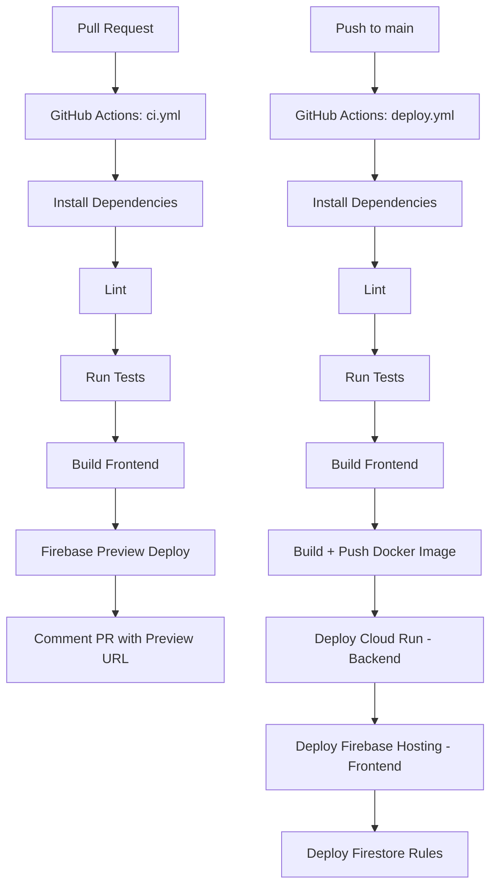

# Plan: Automated Build, Test, and Deploy Pipeline for ShipSmart

## Current State Analysis

### Architecture
- **Frontend**: React + Vite → Firebase Hosting at `shipsmart-app-dev.web.app`
- **Backend**: Node.js + Express → Cloud Run service `shipsmart-api` in `us-central1`
- **Database**: Firebase Firestore
- **Monorepo**: npm workspaces with `packages/shared`, `packages/backend`, `packages/frontend`
- **Existing deploy**: `cloudbuild.yaml` for Cloud Run, `firebase deploy --only hosting` for frontend
- **API routing**: `firebase.json` rewrites `/api/**` to Cloud Run service

### Important Correction
The backend runs on **Cloud Run** (not Cloud Functions). The `firebase.json` uses `run.serviceId` rewrites, and the existing `Dockerfile` + `cloudbuild.yaml` confirm this. The pipeline will deploy accordingly.

### Missing Infrastructure
- No `.firebaserc` file
- No `.github/workflows/` directory
- No unified deploy script
- No preview channel configuration

---

## Pipeline Architecture



---

## Files to Create / Modify

| File | Action | Purpose |
|------|--------|---------|
| `.firebaserc` | Create | Project alias mapping for Firebase CLI |
| `.github/workflows/ci.yml` | Create | PR workflow: lint, test, build, preview deploy |
| `.github/workflows/deploy.yml` | Create | Main branch workflow: full deploy to production |
| `package.json` | Modify | Add unified `deploy` script |
| `.env.example` | Modify | Document all GitHub Secrets needed |
| `.gitignore` | Verify | Ensure `.env` files are covered - already done |

---

## Detailed Design

### 1. `.firebaserc`
```json
{
  "projects": {
    "default": "shipsmart-app-dev"
  }
}
```

### 2. `.github/workflows/ci.yml` — PR Workflow

**Triggers**: Pull requests to `main`

**Steps**:
1. Checkout code
2. Setup Node.js 20
3. `npm ci` — install dependencies
4. `npm run lint` — run linting across all workspaces
5. `npm run build` — build all workspaces (shared → backend → frontend)
6. Run tests: `npm test --workspace=@shipsmart/backend --if-present` and `npm test --workspace=@shipsmart/frontend --if-present` — skip gracefully if none
7. Firebase preview deploy using `FirebaseExtended/action-hosting-deploy@v0` with `channelId: live` set to a PR-specific channel

**Secrets needed**: `FIREBASE_SERVICE_ACCOUNT_SHIPSMART_APP_DEV` (Firebase service account JSON for hosting deploy)

### 3. `.github/workflows/deploy.yml` — Production Deploy

**Triggers**: Push to `main`

**Steps**:
1. Checkout code
2. Setup Node.js 20
3. `npm ci`
4. `npm run lint`
5. `npm run build`
6. Run tests
7. Authenticate to Google Cloud using `google-github-actions/auth@v2` with Workload Identity Federation or service account key
8. Setup gcloud CLI using `google-github-actions/setup-gcloud@v2`
9. Build Docker image: `docker build -t gcr.io/shipsmart-app-dev/shipsmart-api:$GITHUB_SHA .`
10. Push to GCR: `docker push gcr.io/shipsmart-app-dev/shipsmart-api:$GITHUB_SHA`
11. Deploy to Cloud Run: `gcloud run deploy shipsmart-api --image gcr.io/shipsmart-app-dev/shipsmart-api:$GITHUB_SHA --region us-central1 --platform managed --allow-unauthenticated`
12. Set Cloud Run env vars from GitHub Secrets
13. Deploy Firebase Hosting: `firebase deploy --only hosting`
14. Deploy Firestore rules: `firebase deploy --only firestore:rules`

**Secrets needed**:
- `GCP_SA_KEY` — GCP service account JSON with Cloud Run Admin, Storage Admin, and Firebase Hosting Admin roles
- `FIREBASE_SERVICE_ACCOUNT_SHIPSMART_APP_DEV` — Firebase service account for hosting
- `FIREBASE_PROJECT_ID`
- `SHOPIFY_SHARED_SECRET`
- `VEEQO_API_KEY`
- `SHIPSTATION_API_KEY`
- `SHIPSTATION_API_SECRET`

### 4. Cloud Run Environment Variables

Set during deploy via `--set-env-vars` flag:
- `FIREBASE_PROJECT_ID`
- `NODE_ENV=production`
- `PORT=8080`
- `ALLOWED_ORIGINS=https://shipsmart-app-dev.web.app`
- `SHOPIFY_SHARED_SECRET` (from GitHub Secret)
- `VEEQO_API_KEY` (from GitHub Secret)
- `SHIPSTATION_API_KEY` (from GitHub Secret)
- `SHIPSTATION_API_SECRET` (from GitHub Secret)

Note: `FIREBASE_CLIENT_EMAIL` and `FIREBASE_PRIVATE_KEY` are not needed on Cloud Run because the service uses the default service account via Application Default Credentials.

### 5. Manual Deploy Script

Add to root `package.json`:
```
"deploy": "npm run build && gcloud run deploy shipsmart-api --source . --region us-central1 --platform managed && firebase deploy --only hosting,firestore:rules"
```

### 6. Rollback Instructions

Document in the plan:
- **Firebase Hosting**: `firebase hosting:rollback` or use Firebase Console → Hosting → Release History → select previous version
- **Cloud Run**: `gcloud run services update-traffic shipsmart-api --to-revisions=REVISION_NAME=100 --region=us-central1` or use Cloud Console → Cloud Run → Revisions → Route traffic

---

## GitHub Secrets to Configure (User Action Required)

| Secret Name | Description | Where to Get It |
|-------------|-------------|-----------------|
| `GCP_SA_KEY` | GCP service account JSON key | GCP Console → IAM → Service Accounts → Create Key |
| `FIREBASE_SERVICE_ACCOUNT_SHIPSMART_APP_DEV` | Firebase service account JSON | Firebase Console → Project Settings → Service Accounts → Generate Key |
| `SHOPIFY_SHARED_SECRET` | Shopify webhook shared secret | Shopify Admin → App → API credentials |
| `VEEQO_API_KEY` | Veeqo API key | Veeqo dashboard |
| `SHIPSTATION_API_KEY` | ShipStation API key | ShipStation → Settings → API Settings |
| `SHIPSTATION_API_SECRET` | ShipStation API secret | ShipStation → Settings → API Settings |

---

## What We Will NOT Do (Per Requirements)
- Will not set up actual GitHub secrets
- Will not modify API keys or credentials
- Will not change application logic
- Only pipeline infrastructure: workflow files, firebase config, deploy scripts, env templates
