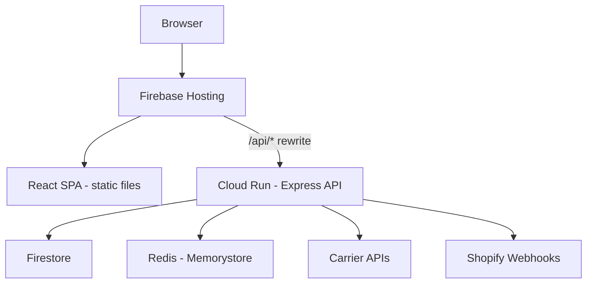
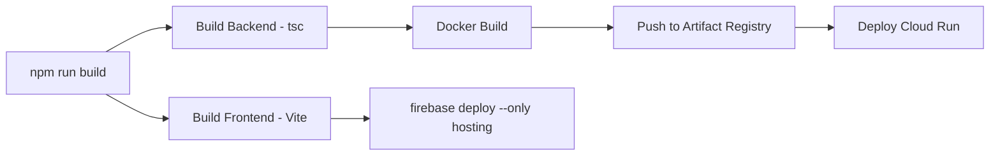

# ShipSmart Deployment Plan

## Recommendation: Firebase Hosting + Cloud Run (All Firebase)

### Why Cloud Run over Cloud Functions for the backend?

Your backend is a **full Express.js server** with:
- Custom middleware stack (helmet, CORS, rate limiting, auth, validation)
- Swagger UI serving
- Redis caching (ioredis)
- Multiple carrier API integrations (FedEx, UPS, USPS, Shippo, ShipStation, Veeqo)
- Webhook signature verification with raw body access
- Long-running API calls to external carrier services

**Cloud Functions** would require refactoring the Express app into individual function handlers, has a 60s default timeout (540s max), cold start issues, and doesn't support persistent Redis connections well.

**Cloud Run** is the right choice because:
- Deploy the Express app as-is with zero refactoring
- Supports persistent connections (Redis, long carrier API calls)
- No timeout constraints (up to 60 minutes)
- Minimum instances setting eliminates cold starts
- Full Docker control over the runtime environment
- Integrates natively with Firebase Hosting via rewrites

### Architecture



### Key Benefit: Single Domain

Firebase Hosting can proxy `/api/*` requests to Cloud Run via rewrites in `firebase.json`. This means:
- No CORS issues (same domain)
- No separate API URL to manage
- Frontend and backend share one domain (e.g., `shipsmart-app-dev.web.app`)

### Deployment Flow



## Implementation Steps

### Phase 1: Local Dev Setup
1. Ensure monorepo installs correctly
2. Add concurrent dev script for frontend + backend
3. Verify both services communicate properly

### Phase 2: Firebase Hosting (Frontend)
1. Add `hosting` config to `firebase.json` pointing to `packages/frontend/dist`
2. Configure SPA rewrites for client-side routing
3. Add Cloud Run rewrite for `/api/*` endpoints
4. Add deploy scripts to root `package.json`

### Phase 3: Cloud Run (Backend)
1. Create `Dockerfile` in `packages/backend/`
2. Create `.dockerignore` 
3. Export the Express `app` for Cloud Run (already done via `export default app`)
4. Ensure `PORT` env var is read from Cloud Run (already done)
5. Add deploy script using `gcloud run deploy`
6. Configure secrets via Secret Manager for carrier API keys

### Phase 4: Firebase Hosting + Cloud Run Integration
1. Add Cloud Run service rewrite in `firebase.json` so `/api/*` routes to Cloud Run
2. Update frontend API service to use relative URLs (`/api/...` instead of `http://localhost:3001/api/...`)
3. Single `firebase deploy` deploys both hosting and the Cloud Run rewrite

## firebase.json Target Configuration

```json
{
  "firestore": {
    "rules": "firestore.rules",
    "indexes": "firestore.indexes.json"
  },
  "hosting": {
    "public": "packages/frontend/dist",
    "ignore": ["firebase.json", "**/.*", "**/node_modules/**"],
    "rewrites": [
      {
        "source": "/api/**",
        "run": {
          "serviceId": "shipsmart-api",
          "region": "us-central1"
        }
      },
      {
        "source": "**",
        "destination": "/index.html"
      }
    ]
  }
}
```
