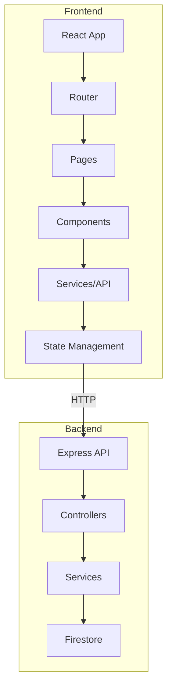

# ShipSmart Frontend Foundation Implementation Plan

## Project Overview

This plan outlines the implementation of the ShipSmart frontend foundation, including Tailwind CSS configuration, reusable components, form handling, error boundaries, and the completion of all main pages with backend API integration.

## Architecture Overview



## Current State Analysis

### Existing Dependencies
- **React 18.2.0** with React Router v6.20.0
- **TanStack Query v5.12.0** for server state
- **Zustand v4.4.0** for client state
- **TanStack Table v8.10.0** for data grids
- **Axios v1.6.0** for HTTP requests

### Current Pages (Stub Implementation)
- `DashboardPage.tsx` - Basic loading state + 3 cards
- `OrdersPage.tsx` - Placeholder text
- `ShipmentsPage.tsx` - Placeholder text
- `ReturnsPage.tsx` - Placeholder text
- `ConsolidationPage.tsx` - Placeholder text
- `CarrierSettingsPage.tsx` - Full implementation exists

### Backend API Endpoints Available
- `GET /api/orders` - List orders with pagination
- `GET /api/orders/:id` - Get single order
- `POST /api/orders/sync` - Sync from Shopify
- `GET /api/shipments` - List shipments
- `POST /api/shipments` - Create shipment
- `GET /api/returns` - List returns
- `POST /api/returns` - Create return
- `GET /api/consolidation/opportunities` - Get consolidation opportunities
- `POST /api/consolidation/apply` - Apply consolidation
- `POST /api/rates/shop` - Rate shopping

---

## Implementation Tasks

### Task 1: Install and Configure Tailwind CSS

**Objective**: Add Tailwind CSS v3 to the frontend project with proper configuration.

**Steps**:
1. Install dependencies: `npm install -D tailwindcss postcss autoprefixer`
2. Initialize Tailwind: `npx tailwindcss init -p`
3. Configure `tailwind.config.js` with content paths
4. Add Tailwind directives to `index.css`
5. Update Vite config if needed

**File Changes**:
- `packages/frontend/package.json` - Add Tailwind dependencies
- `packages/frontend/tailwind.config.js` - Create config
- `packages/frontend/postcss.config.js` - Create config
- `packages/frontend/src/index.css` - Add Tailwind directives

---

### Task 2: Build Reusable Components

**Objective**: Create a component library for the dashboard application.

**Components to Create**:

1. **DashboardCard** (`packages/frontend/src/components/ui/DashboardCard.tsx`)
   - Props: title, value, icon, trend, loading state
   - Features: Display metric with optional trend indicator

2. **DataTable** (`packages/frontend/src/components/ui/DataTable.tsx`)
   - Props: columns, data, sorting, pagination, loading
   - Features: TanStack Table wrapper with default styling

3. **Modal** (`packages/frontend/src/components/ui/Modal.tsx`)
   - Props: isOpen, onClose, title, children, size
   - Features: Overlay, close on escape/backdrop click, animations

4. **RateComparisonPanel** (`packages/frontend/src/components/ui/RateComparisonPanel.tsx`)
   - Props: rates, onSelect, selectedRateId
   - Features: Display carrier quotes, highlight best option

5. **StatusBadge** (`packages/frontend/src/components/ui/StatusBadge.tsx`)
   - Props: status, variant
   - Features: Color-coded status indicators

6. **PageHeader** (`packages/frontend/src/components/ui/PageHeader.tsx`)
   - Props: title, subtitle, actions
   - Features: Standard page header with action buttons

---

### Task 3: Add Form Handling with React Hook Form

**Objective**: Install and configure React Hook Form for address input and package details.

**Steps**:
1. Install: `npm install react-hook-form @hookform/resolvers zod`
2. Create form schemas using Zod
3. Create reusable form components

**Components to Create**:
- `packages/frontend/src/components/forms/AddressForm.tsx` - Address input form
- `packages/frontend/src/components/forms/PackageDetailsForm.tsx` - Package dimensions/weight
- `packages/frontend/src/components/forms/ReturnForm.tsx` - Multi-box return form

**Form Features**:
- Address validation (street, city, state, zip, country)
- Package dimension validation (length, width, height, weight)
- Error messages with field highlighting
- Loading states on submit

---

### Task 4: Implement React Error Boundaries

**Objective**: Add graceful error handling for component failures.

**Steps**:
1. Create ErrorBoundary component
2. Create ErrorFallback component
3. Wrap pages with error boundaries
4. Add error logging utility

**Components to Create**:
- `packages/frontend/src/components/ErrorBoundary.tsx` - Error boundary wrapper
- `packages/frontend/src/components/ErrorFallback.tsx` - Error display UI

**Features**:
- Catch React component errors
- Display user-friendly error message
- Provide retry functionality
- Log errors for debugging

---

### Task 5: Complete Dashboard Page

**Objective**: Build full Dashboard with real data visualization and metrics.

**Steps**:
1. Add API queries for dashboard metrics
2. Create chart components (optional, using simple CSS bars)
3. Implement metric cards with real data
4. Add recent activity section
5. Style with Tailwind

**Features**:
- Pending Orders count
- Active Shipments count
- Consolidation Savings (from consolidation API)
- Recent Orders table
- Recent Shipments table
- Quick action buttons

**API Integration**:
- `ordersApi.list({ page: 1, limit: 10 })`
- `shipmentsApi.list({ page: 1, limit: 10 })`
- `consolidationApi.opportunities()`

---

### Task 6: Build Orders Page

**Objective**: Create data grid with filtering and sorting using React Table.

**Steps**:
1. Create orders table columns configuration
2. Implement table with sorting/filtering
3. Add pagination controls
4. Add row actions (view, ship, consolidate)
5. Style with Tailwind

**Features**:
- Sort by: Order ID, Date, Customer, Status, Total
- Filter by: Status, Date range
- Pagination: 10/20/50 per page
- Row actions: View details, Create shipment, View shipments
- Sync button for Shopify sync

**API Integration**:
- `ordersApi.list({ page, limit, status })`
- `ordersApi.sync()`

---

### Task 7: Build Shipments Page

**Objective**: Create shipment management with rate comparison panel.

**Steps**:
1. Create shipments table
2. Add rate comparison sidebar/panel
3. Implement shipment creation flow
4. Add status tracking
5. Style with Tailwind

**Features**:
- Shipments list with tracking info
- Rate comparison panel (side panel or modal)
- Create shipment with rate selection
- Track shipment status
- Label generation

**API Integration**:
- `shipmentsApi.list()`
- `shipmentsApi.create()`
- `ratesApi.shopRates()`
- `labelsApi.generate()`

---

### Task 8: Build Returns Page

**Objective**: Create multi-box return modal and processing UI.

**Steps**:
1. Create returns list view
2. Implement multi-box return modal
3. Add return status workflow
4. Add return label generation
5. Style with Tailwind

**Features**:
- Returns list with status
- Create return wizard (select order, add boxes, select carrier)
- Multi-box support (add/remove boxes)
- Return status updates
- Label download

**API Integration**:
- `returnsApi.list()`
- `returnsApi.create()`
- `labelsApi.generate()`

---

### Task 9: Build Consolidation Page

**Objective**: Display consolidation opportunities and alerts.

**Steps**:
1. Create consolidation opportunities view
2. Implement opportunity cards
3. Add apply consolidation flow
4. Show savings calculations
5. Style with Tailwind

**Features**:
- Opportunity cards showing potential savings
- Group orders by destination/date
- Apply consolidation button
- Savings summary
- Alert for new opportunities

**API Integration**:
- `consolidationApi.opportunities()`
- `consolidationApi.apply()`

---

### Task 10: Connect Frontend to Backend APIs

**Objective**: Ensure all API client methods work with real endpoints.

**Steps**:
1. Review existing API client
2. Add missing endpoints
3. Add proper TypeScript types
4. Add request/response transformations
5. Test all endpoints

**API Client Methods to Update/Add**:

```typescript
// ordersApi - Add missing methods
- updateStatus(id: string, status: string)

// shipmentsApi - Add missing methods  
- updateStatus(id: string, status: string)

// returnsApi - Add missing methods
- updateStatus(id: string, status: string)

// ratesApi - Already exists
- Add types for rate request/response

// Add dashboard metrics endpoint
- getDashboardMetrics()
```

---

## Implementation Order

1. **Phase 1: Foundation**
   - Task 1: Install Tailwind CSS
   - Task 4: Error Boundaries
   - Task 10: Connect APIs (expand first)

2. **Phase 2: Components**
   - Task 2: Reusable Components
   - Task 3: Form Handling

3. **Phase 3: Pages**
   - Task 5: Dashboard Page
   - Task 6: Orders Page
   - Task 7: Shipments Page
   - Task 8: Returns Page
   - Task 9: Consolidation Page

---

## File Structure After Implementation

```
packages/frontend/src/
├── components/
│   ├── ui/
│   │   ├── DashboardCard.tsx
│   │   ├── DataTable.tsx
│   │   ├── Modal.tsx
│   │   ├── RateComparisonPanel.tsx
│   │   ├── StatusBadge.tsx
│   │   └── PageHeader.tsx
│   ├── forms/
│   │   ├── AddressForm.tsx
│   │   ├── PackageDetailsForm.tsx
│   │   └── ReturnForm.tsx
│   ├── ErrorBoundary.tsx
│   ├── ErrorFallback.tsx
│   └── Layout.tsx
├── pages/
│   ├── DashboardPage.tsx
│   ├── OrdersPage.tsx
│   ├── ShipmentsPage.tsx
│   ├── ReturnsPage.tsx
│   ├── ConsolidationPage.tsx
│   └── CarrierSettingsPage.tsx
├── services/
│   └── api.ts
├── hooks/
│   └── useRateShop.ts
├── stores/
│   ├── useOrderStore.ts
│   └── useShipmentStore.ts
├── types/
│   └── index.ts
├── App.tsx
├── main.tsx
└── index.css
```

---

## Notes

- Use Tailwind CSS v3 for broad compatibility
- Use default Tailwind theme with custom colors for logistics dashboard
- All API calls should use TanStack Query for caching and error handling
- Implement proper loading and error states for all data fetching
- Use Zod schemas from shared package for form validation
