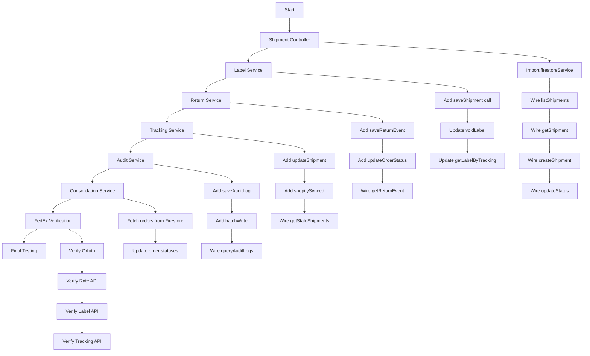

# ShipSmart Implementation Plan: Firestore Persistence & Carrier API Integration

## Overview
This plan outlines the implementation steps to complete Firestore persistence wiring and carrier API integration for the ShipSmart shipping platform.

## Assumptions (Yolo Mode - Proceeding Without Clarification)
- **Priority**: Firestore wiring first (end-to-end data flow), then carrier verification
- **Carrier Scope**: UPS + FedEx (recommended for comparison)
- **Environment**: Graceful fallback when credentials unavailable

---

## Phase 1: Firestore Persistence Wiring

### 1.1 Shipment Controller (`packages/backend/src/controllers/shipments.ts`)
**Current State**: Uses mock data, TODO comments for service calls
**Required Changes**:
- Import `firestoreService` from `../services/firestore`
- Wire `listShipmentsHandler` to call `firestoreService.listShipments()`
- Wire `getShipmentHandler` to call `firestoreService.getShipment()`
- Wire `createShipmentHandler` to call `firestoreService.saveShipment()`
- Wire `updateShipmentStatusHandler` to call `firestoreService.updateShipmentStatus()`

### 1.2 Label Service (`packages/backend/src/services/label.ts`)
**Current State**: Line 172-173 has TODO comment for Firestore save
**Required Changes**:
```typescript
// TODO: Save shipment to Firestore
// Replace with:
await firestoreService.saveShipment(shipment);
```
- Also update `voidLabel` to update shipment status in Firestore
- Update `getLabelByTrackingNumber` to query Firestore

### 1.3 Return Service (`packages/backend/src/services/returns.ts`)
**Current State**: Lines 125-132 have TODO comments
**Required Changes**:
- Import `firestoreService` from `./firestore`
- Add `firestoreService.saveReturnEvent(returnEvent)` after line 123
- Add `firestoreService.updateDocument('orders', request.originalOrderId, { status: OrderStatus.Returned })` after line 128
- Update `getReturnEvent`, `listReturnEventsForOrder`, `updateReturnStatus` to query Firestore

### 1.4 Consolidation Service (`packages/backend/src/services/consolidation.ts`)
**Current State**: Line 292 has TODO comments for Firestore
**Required Changes**:
- Import `firestoreService` from `./firestore`
- Fetch orders from Firestore in `consolidateOrders()` function
- Update order statuses to 'consolidated' after consolidation

### 1.5 Tracking Service (`packages/backend/src/services/tracking.ts`)
**Current State**: Lines 105-109, 149-153 have TODO comments
**Required Changes**:
- Import `firestoreService` from `./firestore`
- Add `firestoreService.updateDocument('shipments', shipment.id, {...})` in `updateTrackingStatus()`
- Add Firestore update for shopifySynced flag in `syncTrackingToShopify()`
- Update `getStaleShipments()` to query Firestore

### 1.6 Audit Service (`packages/backend/src/services/audit.ts`)
**Current State**: Line 89 has TODO for Firestore save
**Required Changes**:
- Import `firestoreService` from `./firestore`
- Add `await firestoreService.saveAuditLog(auditLog)` in `createAuditLog()`
- Add batch write in `createAuditLogs()` using `firestoreService.batchWrite()`
- Use `firestoreService.queryAuditLogs()` in `queryAuditLogs()`

---

## Phase 2: Carrier API Verification

### 2.1 UPS Gateway (`packages/backend/src/services/carriers/ups.ts`)
**Current State**: Already complete with real API calls
**Verification**: 
- OAuth token management (lines 81-120)
- Rate quote API (lines 125-250)
- Label generation API (lines 255-362)
- Tracking API (lines 393-447)
**Status**: ✅ No changes needed

### 2.2 FedEx Gateway (`packages/backend/src/services/carriers/fedex.ts`)
**Current State**: Needs verification of real API implementation
**Verification Required**:
- Check if OAuth token management is implemented
- Check if rate quote API uses real FedEx endpoints
- Check if label generation uses real FedEx endpoints
- Check if tracking uses real FedEx endpoints

---

## Phase 3: Verification & Testing

### 3.1 Cache Service (`packages/backend/src/services/cache.ts`)
**Current State**: Already has Redis integration with fallback to memory
**Verification**: 
- Constructor handles missing REDIS_URL gracefully (lines 110-123)
- RedisCache class uses ioredis properly (lines 59-94)
**Status**: ✅ Complete

### 3.2 Rate Shop Service (`packages/backend/src/services/rate-shop.ts`)
**Current State**: Already uses carrierRegistry (line 149)
**Verification**:
- Line 127-129: `getCarrierGateways()` returns enabled carriers from registry
- Line 152-159: Parallel carrier API calls via real gateways
**Status**: ✅ Complete

---

## Implementation Order

1. **Shipment Controller** - Most critical for data flow
2. **Label Service** - Core shipping workflow
3. **Return Service** - Return processing
4. **Tracking Service** - Status updates
5. **Audit Service** - Compliance logging
6. **Consolidation Service** - Order grouping
7. **FedEx Verification** - Complete carrier integration
8. **Final Testing** - End-to-end flow verification

---

## Error Handling Strategy
All Firestore operations should use the existing graceful degradation pattern:
- If Firestore not initialized, log warning and continue (mock mode)
- Return mock data when database operations fail
- Don't break the application flow

## Environment Variables Required
```
# UPS (if credentials available)
UPS_CLIENT_ID=your_client_id
UPS_CLIENT_SECRET=your_client_secret

# FedEx (if credentials available)
FEDEX_API_KEY=your_api_key
FEDEX_API_SECRET=your_api_secret

# Redis (optional - uses memory cache if not set)
REDIS_URL=redis://localhost:6379
```

## Mermaid: Implementation Flow



---

## Notes
- UPS already has complete real API implementation
- FedEx needs verification - may need completion
- All services should continue working even without Firestore (mock mode)
- Cache service already complete with Redis fallback
- Rate shop already uses real carrier gateways