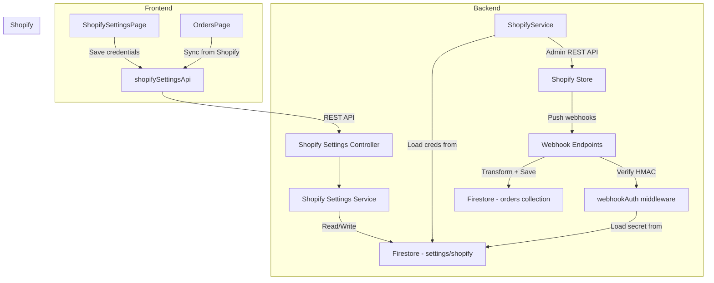
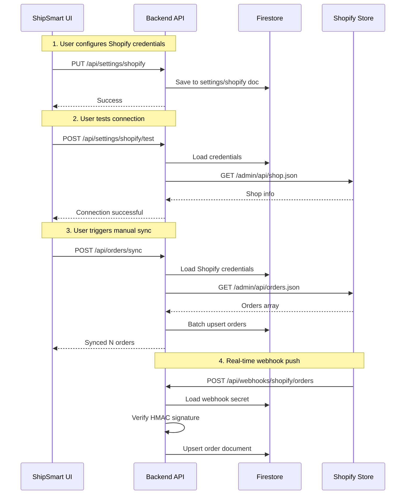

# Shopify Direct API Integration Plan

## Overview

Replace the Google Sheets middleman with a direct Shopify Admin REST API integration. Shopify credentials (store domain, access token, webhook secret) will be managed through the ShipSmart UI and stored in Firestore — following the same pattern as the existing carrier settings.

## Architecture



## Data Flow



## Files to Create/Modify

### New Files
| File | Purpose |
|------|---------|
| `packages/backend/src/services/shopify-settings.ts` | Shopify credential CRUD in Firestore |
| `packages/backend/src/controllers/shopify-settings.ts` | REST endpoints for Shopify settings |
| `packages/frontend/src/pages/ShopifySettingsPage.tsx` | UI for entering Shopify credentials |

### Modified Files
| File | Changes |
|------|---------|
| `packages/backend/src/services/shopify.ts` | Load credentials from Firestore instead of env vars |
| `packages/backend/src/controllers/webhooks.ts` | Complete the two TODO stub handlers |
| `packages/backend/src/middleware/webhookAuth.ts` | Load Shopify secret from Firestore |
| `packages/backend/src/routes/settings.ts` | Add Shopify settings routes |
| `packages/frontend/src/services/api.ts` | Add shopifySettingsApi |
| `packages/frontend/src/App.tsx` | Add /settings/shopify route |
| `packages/frontend/src/components/Layout.tsx` | Add Shopify nav item under Settings |
| `packages/frontend/src/pages/SettingsPage.tsx` | Add Shopify connection status row |

---

## Detailed Coding Agent Prompt

Below is the prompt to give to the coding agent. It contains all the context and specific instructions needed to implement this feature.

---

### AGENT PROMPT START

**Task: Implement Shopify Direct API Integration with UI-Managed Credentials**

Implement a direct Shopify Admin REST API integration for ShipSmart. The user must be able to enter their Shopify store domain, Admin API access token, and webhook shared secret through the Settings UI. Credentials are stored in Firestore. Follow the exact same pattern used by the existing carrier settings feature.

**IMPORTANT CONTEXT — Existing Patterns to Follow:**

1. **Carrier Settings Service** (`packages/backend/src/services/carrier-settings.ts`) — This is the pattern for storing API credentials in Firestore. It has `CarrierCredentials` interface, `saveCarrierSettings()`, `getCarrierSettings()`, `getMaskedCredentials()`, and `testCarrierConnection()`. Replicate this pattern for Shopify.

2. **Carrier Settings Controller** (`packages/backend/src/controllers/carrier-settings.ts`) — REST endpoints: `GET /api/settings/carriers`, `PUT /api/settings/carriers/:id`, `POST /api/settings/carriers/:id/test`. Create equivalent Shopify endpoints.

3. **CarrierSettingsPage** (`packages/frontend/src/pages/CarrierSettingsPage.tsx`) — UI with expandable cards, credential input fields (masked for secrets), enable/disable toggles, sandbox toggle, save button, and test connection button. Create a similar page for Shopify.

4. **Settings Routes** (`packages/backend/src/routes/settings.ts`) — Add Shopify routes here alongside the existing carrier routes.

5. **Frontend API** (`packages/frontend/src/services/api.ts`) — Add `shopifySettingsApi` following the same pattern as `carrierSettingsApi`.

---

**STEP 1: Create `packages/backend/src/services/shopify-settings.ts`**

Create a new service that manages Shopify credentials in Firestore. Store them in a single document at `settings/shopify` in Firestore.

```typescript
// Interface for Shopify settings stored in Firestore
interface ShopifySettings {
  storeDomain: string;       // e.g., my-store.myshopify.com
  accessToken: string;       // Shopify Admin API access token
  webhookSecret: string;     // Shopify webhook shared secret for HMAC verification
  apiVersion: string;        // e.g., 2024-01
  enabled: boolean;          // Whether Shopify integration is active
  lastSyncAt?: Date;         // Last successful sync timestamp
  webhookRegistered?: boolean; // Whether webhooks have been registered
  createdAt?: Date;
  updatedAt?: Date;
}
```

Functions to implement:
- `getShopifySettings()` — Read from Firestore `settings/shopify` doc
- `saveShopifySettings(settings)` — Write to Firestore, update `updatedAt`
- `getMaskedShopifySettings()` — Return settings with accessToken and webhookSecret masked (show last 4 chars only)
- `testShopifyConnection()` — Use the stored credentials to call `GET /admin/api/{version}/shop.json` and return success/failure
- `updateLastSyncTimestamp()` — Update the `lastSyncAt` field

---

**STEP 2: Create `packages/backend/src/controllers/shopify-settings.ts`**

Create controller with these handlers:

- `GET /api/settings/shopify` → `getShopifySettingsHandler` — Returns masked settings + connection status
- `PUT /api/settings/shopify` → `updateShopifySettingsHandler` — Saves new credentials. Validate that storeDomain and accessToken are provided. Only update fields that are non-empty (so user can update domain without re-entering token).
- `POST /api/settings/shopify/test` → `testShopifyConnectionHandler` — Tests the connection by calling Shopify API
- `POST /api/settings/shopify/sync` → `triggerShopifySyncHandler` — Triggers an order sync (reuse existing `syncFromShopifyHandler` logic but load creds from Firestore)

---

**STEP 3: Add routes to `packages/backend/src/routes/settings.ts`**

Add these routes to the existing settings router:

```typescript
import { getShopifySettingsHandler, updateShopifySettingsHandler, testShopifyConnectionHandler, triggerShopifySyncHandler } from '../controllers/shopify-settings';

// Shopify settings
router.get('/shopify', getShopifySettingsHandler);
router.put('/shopify', updateShopifySettingsHandler);
router.post('/shopify/test', testShopifyConnectionHandler);
router.post('/shopify/sync', triggerShopifySyncHandler);
```

---

**STEP 4: Refactor `packages/backend/src/services/shopify.ts`**

Modify the `ShopifyService` class to support loading credentials from Firestore:

- Add a static async factory method `ShopifyService.fromFirestore()` that reads credentials from the `shopify-settings` service and creates a configured instance
- Keep the existing constructor for backward compatibility (env vars as fallback)
- Add a `refreshConfig()` method that reloads credentials from Firestore
- The `isConfigured()` method should check if both storeDomain and accessToken are non-empty

Update `syncFromShopifyHandler` in `packages/backend/src/controllers/orders.ts` to use `ShopifyService.fromFirestore()` instead of the singleton `shopifyService`.

---

**STEP 5: Complete webhook handlers in `packages/backend/src/controllers/webhooks.ts`**

**5a. `handleShopifyOrderWebhook`** (line 122-153) — Replace the TODO stub:
- Import `shopifyService` and create an instance via `ShopifyService.fromFirestore()`
- Call `shopifyService.transformOrder(payload)` to transform the Shopify order
- Check if order exists in Firestore by shopifyOrderId
- If exists: update it. If not: create it.
- Add idempotency: check `X-Shopify-Webhook-Id` header to prevent duplicate processing. Store processed webhook IDs in a Firestore collection `processedWebhooks` with a TTL.

**5b. `handleShopifyFulfillmentWebhook`** (line 159-190) — Replace the TODO stub:
- Extract tracking number and fulfillment status from the payload
- Find the corresponding shipment in Firestore by order ID
- Update the shipment status based on fulfillment status
- Log an audit event

---

**STEP 6: Update `packages/backend/src/middleware/webhookAuth.ts`**

Modify `verifyShopifyWebhook` to load the webhook secret from Firestore (via `getShopifySettings()`) instead of only from `env.shopifySharedSecret`. Fall back to env var if Firestore settings are not configured.

---

**STEP 7: Add `shopifySettingsApi` to `packages/frontend/src/services/api.ts`**

Add this to the frontend API service:

```typescript
export const shopifySettingsApi = {
  get: () =>
    api.get<ApiResponse<unknown>>('/settings/shopify').then((r) => r.data),
  update: (data: { storeDomain: string; accessToken: string; webhookSecret: string; apiVersion: string; enabled: boolean }) =>
    api.put<ApiResponse<unknown>>('/settings/shopify', data).then((r) => r.data),
  test: () =>
    api.post<ApiResponse<unknown>>('/settings/shopify/test').then((r) => r.data),
  sync: () =>
    api.post<ApiResponse<unknown>>('/settings/shopify/sync').then((r) => r.data),
};
```

---

**STEP 8: Create `packages/frontend/src/pages/ShopifySettingsPage.tsx`**

Create a settings page following the same visual style as `CarrierSettingsPage.tsx`. The page should have:

**Header section:**
- Title: "Shopify Integration"
- Subtitle: "Connect your Shopify store to automatically sync orders"
- Connection status badge (green = connected, gray = not configured, red = error)

**Settings form card:**
- **Store Domain** — text input, placeholder "my-store.myshopify.com", not secret
- **Admin API Access Token** — password input, masked, show last 4 chars when saved
- **Webhook Shared Secret** — password input, masked, show last 4 chars when saved
- **API Version** — text input, default "2024-01"
- **Enabled** toggle switch
- **Save** button
- **Test Connection** button — calls the test endpoint and shows success/error message

**Sync section card:**
- Last sync timestamp display
- "Sync Orders Now" button — triggers manual sync, shows count of synced orders
- Sync status/progress indicator

**Info section:**
- Required Shopify API scopes: `read_orders`, `write_orders`, `read_fulfillments`, `write_fulfillments`
- Instructions: "Create a Custom App in your Shopify admin under Settings > Apps and sales channels > Develop apps"
- Webhook URL to register: `{your-domain}/api/webhooks/shopify/orders`

Use the same Tailwind CSS classes and dark mode support as the existing `CarrierSettingsPage` and `SettingsPage`.

---

**STEP 9: Add route and navigation**

**9a. `packages/frontend/src/App.tsx`** — Add route:
```tsx
<Route path="settings/shopify" element={<ShopifySettingsPage />} />
```

**9b. `packages/frontend/src/components/Layout.tsx`** — Add a "Shopify" nav item in the Settings section of the sidebar, next to the existing "Carriers" link. Use a shopping bag or store icon.

---

**STEP 10: Update `packages/frontend/src/pages/SettingsPage.tsx`**

Add a "Shopify Integration" row in the API Configuration section that shows whether Shopify is configured/connected. Link it to `/settings/shopify`.

---

**Key Implementation Notes:**

1. **Security**: Never return raw accessToken or webhookSecret to the frontend. Always mask them (show only last 4 characters like `••••••••abcd`).

2. **Credential update logic**: When the user saves settings, if accessToken or webhookSecret is empty string, keep the existing value in Firestore (don't overwrite with empty). This allows updating the domain without re-entering the token.

3. **Firestore document path**: Store Shopify settings at `settings/shopify` (single document, not a collection).

4. **Backward compatibility**: Keep env var support as fallback. If Firestore settings are not configured, fall back to `SHOPIFY_STORE_DOMAIN`, `SHOPIFY_ACCESS_TOKEN`, and `SHOPIFY_SHARED_SECRET` env vars.

5. **Error handling**: All Shopify API calls should have proper try/catch with meaningful error messages. The test connection endpoint should return the shop name on success.

6. **The existing `shopifyService` singleton** in `packages/backend/src/services/shopify.ts` line 274 should be kept but deprecated. New code should use `ShopifyService.fromFirestore()`.

### AGENT PROMPT END
