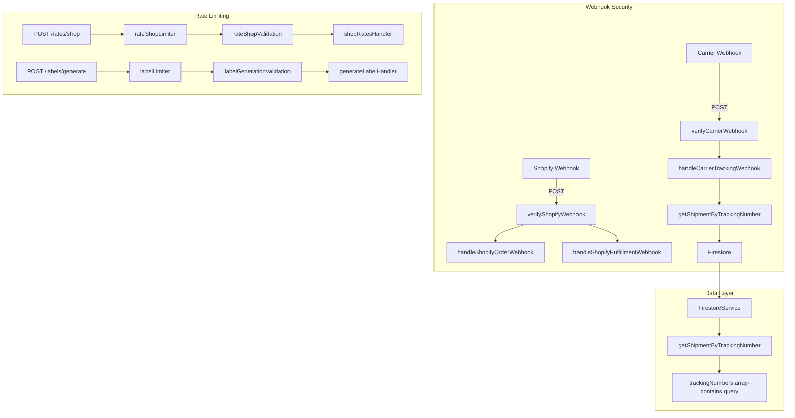

# Plan: Webhook Security & Code Quality Fixes

## Overview

This plan addresses all findings from the code review of uncommitted changes on `main`. The changeset introduces Swagger API documentation, webhook handlers, Redis caching, rate limiting, request validation, retry/circuit-breaker utilities, Shopify integration, and various bug fixes.

---

## Critical Fixes

### 1. Webhook Signature Verification Middleware

**Problem:** Webhook endpoints accept POST requests without any HMAC/signature verification. Anyone can send fake tracking updates, mark shipments as delivered, or inject fake orders. Shopify webhooks require HMAC verification using the shared secret.

**Solution:** Create a new middleware file `packages/backend/src/middleware/webhookAuth.ts` that provides two verification functions:

#### 1a. Shopify Webhook Verification

Shopify sends an `X-Shopify-Hmac-Sha256` header which is an HMAC-SHA256 signature of the raw request body using the Shopify shared secret.

```typescript
// packages/backend/src/middleware/webhookAuth.ts
import { Request, Response, NextFunction } from 'express';
import crypto from 'crypto';
import { env } from '../config/environment';

// Add SHOPIFY_SHARED_SECRET to environment config
export function verifyShopifyWebhook(req: Request, res: Response, next: NextFunction): void {
  const hmacHeader = req.headers['x-shopify-hmac-sha256'] as string;
  if (!hmacHeader) {
    res.status(401).json({ success: false, error: 'Missing Shopify HMAC signature' });
    return;
  }

  const body = JSON.stringify(req.body); // Note: needs raw body for proper verification
  const computedHmac = crypto
    .createHmac('sha256', env.shopifySharedSecret)
    .update(body, 'utf8')
    .digest('base64');

  if (computedHmac !== hmacHeader) {
    res.status(401).json({ success: false, error: 'Invalid Shopify HMAC signature' });
    return;
  }

  next();
}
```

**Important Note:** HMAC verification requires the **raw** request body, not the parsed JSON. We need to add a `raw-body` middleware or use Express's `verify` option on `express.json()` for webhook routes.

#### 1b. Carrier Webhook Verification

Since carriers vary in their signature approaches, we'll implement a configurable verification that:
- Checks for a configurable secret per carrier (stored in environment)
- Validates signature if present, otherwise logs a warning (allows development without carrier secrets)

```typescript
export function verifyCarrierWebhook(req: Request, res: Response, next: NextFunction): void {
  const { carrier } = req.params as { carrier: string };
  const signature = req.headers['x-carrier-signature'] as string;
  const secret = process.env[`CARRIER_WEBHOOK_SECRET_${carrier.toUpperCase()}`];

  if (!secret) {
    console.warn(`[Webhook] No webhook secret configured for carrier: ${carrier}`);
    next(); // Allow in development
    return;
  }

  if (!signature) {
    res.status(401).json({ success: false, error: 'Missing carrier signature' });
    return;
  }

  // Verify HMAC signature
  const body = JSON.stringify(req.body);
  const computedHmac = crypto
    .createHmac('sha256', secret)
    .update(body, 'utf8')
    .digest('hex');

  if (signature !== computedHmac) {
    res.status(401).json({ success: false, error: 'Invalid carrier signature' });
    return;
  }

  next();
}
```

#### 1c. Environment Configuration Updates

Add to `packages/backend/src/config/environment.ts`:
```typescript
// Add to env object:
shopifySharedSecret: process.env.SHOPIFY_SHARED_SECRET || '',
```

Add to `packages/backend/.env.example`:
```
SHOPIFY_SHARED_SECRET=
CARRIER_WEBHOOK_SECRET_FEDEX=
CARRIER_WEBHOOK_SECRET_UPS=
CARRIER_WEBHOOK_SECRET_USPS=
```

#### 1d. Route Updates

Update `packages/backend/src/routes/webhooks.ts` to apply the middleware:
```typescript
import { verifyShopifyWebhook, verifyCarrierWebhook } from '../middleware/webhookAuth';

router.post('/carriers/:carrier/tracking', verifyCarrierWebhook, handleCarrierTrackingWebhook);
router.post('/shopify/orders', verifyShopifyWebhook, handleShopifyOrderWebhook);
router.post('/shopify/fulfillments', verifyShopifyWebhook, handleShopifyFulfillmentWebhook);
```

---

### 2. Fix Carrier Webhook Shipment Lookup

**Problem:** `handleCarrierTrackingWebhook` calls `listShipments({ limit: 1 })` and searches through that single shipment. This will almost never find the correct shipment.

**Solution:** Add a `getShipmentByTrackingNumber` method to `FirestoreService`.

#### 2a. Add Method to FirestoreService

In `packages/backend/src/services/firestore.ts`, add:

```typescript
/** Get a shipment by tracking number */
async getShipmentByTrackingNumber(trackingNumber: string): Promise<Shipment | null> {
  const db = getFirestore();
  if (!db) {
    console.warn(`[Firestore] Cannot query: Firestore not initialized`);
    return null;
  }

  try {
    // Query shipments where trackingNumbers array contains the tracking number
    const snapshot = await db
      .collection('shipments')
      .where('trackingNumbers', 'array-contains', trackingNumber)
      .limit(1)
      .get();

    if (snapshot.empty) return null;
    const doc = snapshot.docs[0];
    return { id: doc.id, ...doc.data() } as Shipment;
  } catch (error) {
    console.error(`[Firestore] Error querying shipment by tracking number:`, error);
    throw error;
  }
}
```

#### 2b. Update Webhook Controller

In `packages/backend/src/controllers/webhooks.ts`, replace lines 66-70:

```typescript
// Before (broken):
const { items: shipments } = await firestoreService.listShipments({ limit: 1 });
const shipment = shipments.find((s) => s.trackingNumbers.includes(payload.trackingNumber));

// After (correct):
const shipment = await firestoreService.getShipmentByTrackingNumber(payload.trackingNumber);
```

---

## Warning Fixes

### 3. Wire Validation Middleware into Routes

**Problem:** The `validation.ts` and `validate.ts` middleware define comprehensive rules but none of the route files import or use them.

**Solution:** Wire the validation middleware into the appropriate routes using the `validate()` wrapper from `validate.ts`.

#### 3a. Rate Shopping Routes (`packages/backend/src/routes/rates.ts`)

```typescript
import { Router } from 'express';
import { shopRatesHandler } from '../controllers/rates';
import { rateShopLimiter } from '../middleware/rateLimiter';
import { validate } from '../middleware/validate';
import { rateShopValidation } from '../middleware/validation';

const router = Router();

router.post('/shop', rateShopLimiter, validate(rateShopValidation), shopRatesHandler);

export default router;
```

#### 3b. Label Routes (`packages/backend/src/routes/labels.ts`)

```typescript
import { Router } from 'express';
import { generateLabelHandler, voidLabelHandler, reprintLabelHandler } from '../controllers/labels';
import { labelLimiter } from '../middleware/rateLimiter';
import { validate } from '../middleware/validate';
import { labelGenerationValidation, voidLabelValidation } from '../middleware/validation';

const router = Router();

router.post('/generate', labelLimiter, validate(labelGenerationValidation), generateLabelHandler);
router.post('/void', validate(voidLabelValidation), voidLabelHandler);
router.get('/:trackingNumber/reprint', reprintLabelHandler);

export default router;
```

#### 3c. Return Routes (`packages/backend/src/routes/returns.ts`)

```typescript
import { Router } from 'express';
import { createReturnHandler, listReturnsHandler, getReturnHandler, updateReturnStatusHandler } from '../controllers/returns';
import { validate } from '../middleware/validate';
import { createReturnValidation } from '../middleware/validation';

const router = Router();

router.post('/', validate(createReturnValidation), createReturnHandler);
router.get('/', listReturnsHandler);
router.get('/:id', getReturnHandler);
router.patch('/:id/status', updateReturnStatusHandler);

export default router;
```

#### 3d. Shipment Routes (`packages/backend/src/routes/shipments.ts`)

Need to check current content and add `createShipmentValidation` + `paginationValidation`.

#### 3e. Consolidation Routes (`packages/backend/src/routes/consolidation.ts`)

Need to check current content and add `consolidateOrdersValidation`.

---

### 4. Wire Rate Limiter Middleware

**Problem:** Only `generalLimiter` is applied globally. Specific limiters (`rateShopLimiter`, `labelLimiter`) are defined but not used.

**Solution:** Already addressed in the validation wiring above (items 3a, 3b). The rate limiters are applied as middleware before the handlers.

---

### 5. Fix RedisCache to Use Static Import

**Problem:** `packages/backend/src/services/cache.ts:63` uses `require('ioredis')` instead of static import.

**Solution:** Change to a top-level static import.

```typescript
// Before:
class RedisCache implements CacheProvider {
  private redis: import('ioredis').Redis;

  constructor(redisUrl: string) {
    const Redis = require('ioredis');
    this.redis = new Redis(redisUrl);
  }
}

// After:
import Redis from 'ioredis';

class RedisCache implements CacheProvider {
  private redis: Redis;

  constructor(redisUrl: string) {
    this.redis = new Redis(redisUrl);
  }
}
```

---

### 6. Fix LTL Weight Check No-Op

**Problem:** `packages/backend/src/services/rate-shop.ts:213` has an empty `if` block for LTL weight check that works by accident but is misleading.

**Current code:**
```typescript
if (exceedsWeightLimit(pkg.weight, this.id)) {
  if (this.id === CarrierId.LTL) {
    // LTL can handle oversized packages
  } else {
    return null;
  }
}
```

**Solution:** Make the intent explicit with a `continue`:

```typescript
if (exceedsWeightLimit(pkg.weight, this.id)) {
  if (this.id === CarrierId.LTL) {
    // LTL can handle oversized packages, continue processing
    continue;
  } else {
    return null;
  }
}
```

---

### 7. Fix Unused fromAddress/toAddress in Returns

**Problem:** `packages/backend/src/services/returns.ts:156-157` marks `fromAddress` and `toAddress` as `void` (unused), so return labels are generated without address data.

**Solution:** Pass the addresses to the carrier's `createLabel` method. Need to check the carrier gateway interface to understand how to properly integrate.

```typescript
// Before:
void fromAddress;
void toAddress;

// After - integrate with carrier gateway:
const carrierGateway = getCarrierGateway(carrier);
const labelResult = await carrierGateway.createLabel({
  fromAddress,
  toAddress,
  packages: boxes.map((box) => ({
    weight: box.weight,
    length: box.length,
    width: box.width,
    height: box.height,
  })),
  serviceLevel: 'ground', // or appropriate default
});
```

**Note:** This depends on the carrier gateway being fully implemented. If not ready, add a TODO comment and keep the mock but log a warning.

---

## Suggestion Fixes

### 8. Remove @types/ioredis

**Problem:** `@types/ioredis` is unnecessary since ioredis v5 ships with built-in types.

**Solution:** Remove from `packages/backend/package.json`:
```json
// Remove this line:
"@types/ioredis": "^4.28.10",
```

---

### 9. Remove or Integrate swagger-jsdoc

**Problem:** `swagger-jsdoc` is added as a dependency but never used — swagger is manually defined in `config/swagger.ts`.

**Solution:** Two options:

**Option A (Recommended):** Remove `swagger-jsdoc` since the project already uses manual swagger configuration in `config/swagger.ts`.

**Option B:** Integrate `swagger-jsdoc` by adding JSDoc comments to route handlers and generating the spec from them. This is more work but provides better documentation co-location.

**Recommendation:** Option A — remove the unused dependency. The current manual approach in `config/swagger.ts` is working and doesn't need JSDoc-based generation.

---

## Implementation Order

1. **Critical First** (security):
   - Fix #2: Add `getShipmentByTrackingNumber` to FirestoreService (quick fix, unblocks testing)
   - Fix #1: Add webhook signature verification middleware (security critical)

2. **Warning Fixes** (data quality and correctness):
   - Fix #3 & #4: Wire validation and rate limiter middleware into routes
   - Fix #5: Fix RedisCache static import
   - Fix #6: Fix LTL weight check no-op
   - Fix #7: Fix unused addresses in returns (may need carrier gateway integration)

3. **Suggestion Fixes** (cleanup):
   - Fix #8: Remove `@types/ioredis`
   - Fix #9: Remove `swagger-jsdoc`

---

## Files to Create

- `packages/backend/src/middleware/webhookAuth.ts` — Webhook signature verification middleware

## Files to Modify

- `packages/backend/src/routes/webhooks.ts` — Add verification middleware
- `packages/backend/src/routes/rates.ts` — Add validation + rate limiting
- `packages/backend/src/routes/labels.ts` — Add validation + rate limiting
- `packages/backend/src/routes/returns.ts` — Add validation
- `packages/backend/src/routes/shipments.ts` — Add validation (if applicable)
- `packages/backend/src/routes/consolidation.ts` — Add validation (if applicable)
- `packages/backend/src/controllers/webhooks.ts` — Fix shipment lookup
- `packages/backend/src/services/firestore.ts` — Add `getShipmentByTrackingNumber`
- `packages/backend/src/services/cache.ts` — Fix ioredis import
- `packages/backend/src/services/rate-shop.ts` — Fix LTL weight check
- `packages/backend/src/services/returns.ts` — Fix unused addresses
- `packages/backend/src/config/environment.ts` — Add Shopify secret config
- `packages/backend/.env.example` — Add new env vars
- `packages/backend/package.json` — Remove unused dependencies

---

## Mermaid Architecture Diagram


